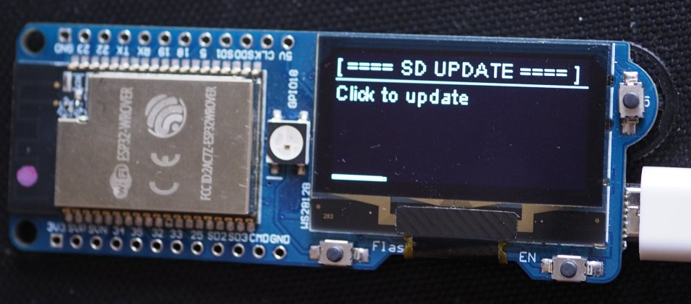
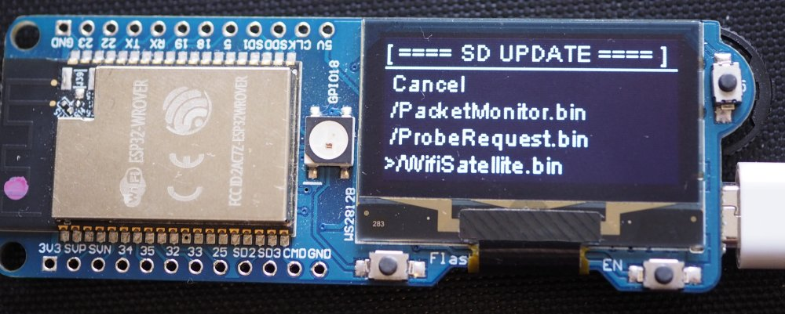
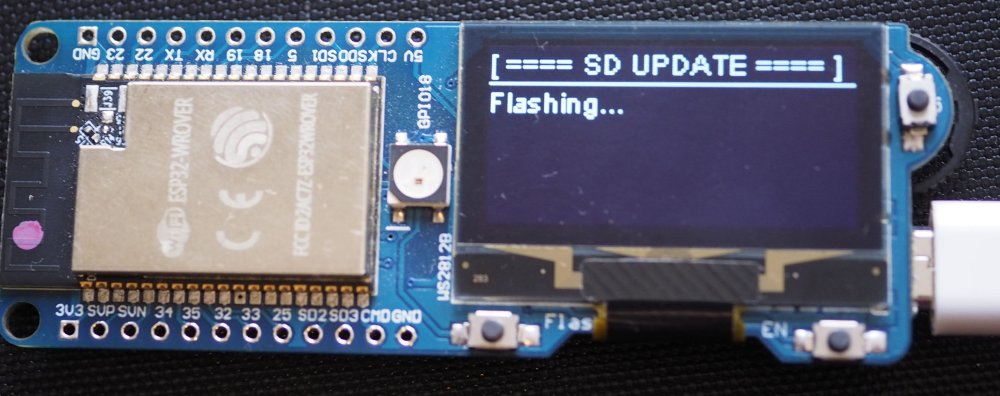
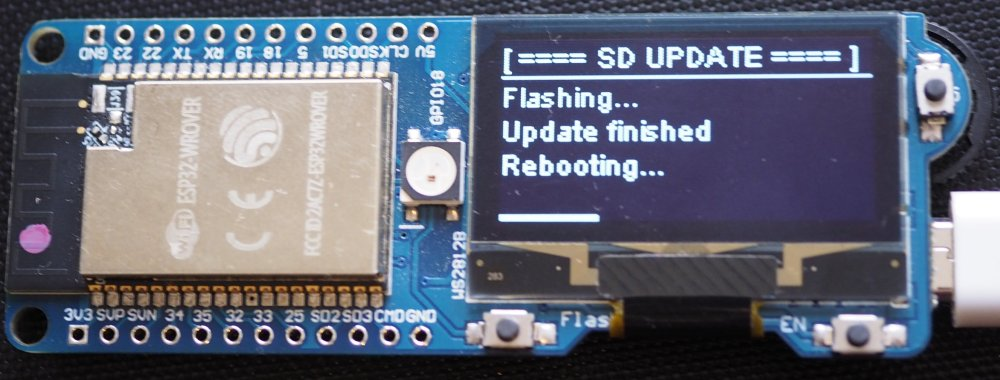

# DstikeUpdater OLED
ESP32 OLED SD Updater Library for DSTIKE Boards

## Supported Devices

This library is made for the **DSTIKE D-duino-32 Final** and **DSTIKE ESP32 Watch DevKit OLED**.  

But it can also run on other boards that fulfill these requirements:  
- ESP32 SoC
- OLED display (SSD1306 or SH1106) with 128x64 pixel
- Up, down and select buttons as [input pullup](https://www.arduino.cc/en/Tutorial/InputPullupSerial)
- SD card slot connected to the SD/MMC pins (check [this example](https://github.com/espressif/arduino-esp32/blob/master/libraries/SD_MMC/examples/SDMMC_Test/SDMMC_Test.ino))

## Installation

1) Click [Download Zip](https://github.com/spacehuhn/DstikeUpdater/archive/master.zip) to download the source code from GitHub.
2) Unzip and rename the Folder name to "DstikeUpdater".
3) Paste it in your library folder (usually located somewhere at documents/Arduino/libraries).
4) Restart the Arduino IDE.

5) Install the OLED library using the same steps, from [ThingPulse/esp8266-oled-ssd1306](https://github.com/ThingPulse/esp8266-oled-ssd1306)

## Usage

### Arduino IDE
1) Include the library `#include <DstikeUpdater.h>`
2) In the begin of `void setup()` add `DstikeUpdater::run()`

Example for DSTIKE D-duino-32 Final:   
```c++
#include <DstikeUpdater.h> // Include updater library

// Pin definitions
#define BUTTON_UP 32
#define BUTTON_DOWN 25
#define BUTTON_SELECT 33
#define OLED_SDA 26
#define OLED_SCK 27

void setup() {
    // Run updater
    DstikeUpdater::runSH1106(OLED_SDA, OLED_SCK, BUTTON_UP, BUTTON_DOWN, BUTTON_SELECT);

    // ...
}

void loop() {
    // ...
}
```

Definition of the `run` method:  
```c++
static void run(OLEDDisplay & display, int up, int down, int select, const char* path   = UPDATER_PATH, int loadingDelay = LOADING_DELAY);
static void runSH1106(int sda, int sck, int up, int down, int select, const char* path  = UPDATER_PATH, int loadingDelay = LOADING_DELAY);
static void runSSD1306(int sda, int sck, int up, int down, int select, const char* path = UPDATER_PATH, int loadingDelay = LOADING_DELAY);
```

`UPDATER_PATH` defaults to `"/update"`.  
`LOADING_DELAY` defaults to `3500`.  

### Dev. Board

1) Get a micro SD card and format it to FAT32
2) Create the `update` folder in root
3) Move your `*.bin` files in the `update` folder (`SD:\update\yourfile.bin`)
4) Power up your board
5) Press a button in the first 3 seconds to start the updater
6) Select a file to flash it

  

  

  

  

## License

This software is licensed under the MIT License. See the [license file](LICENSE) for details.  
